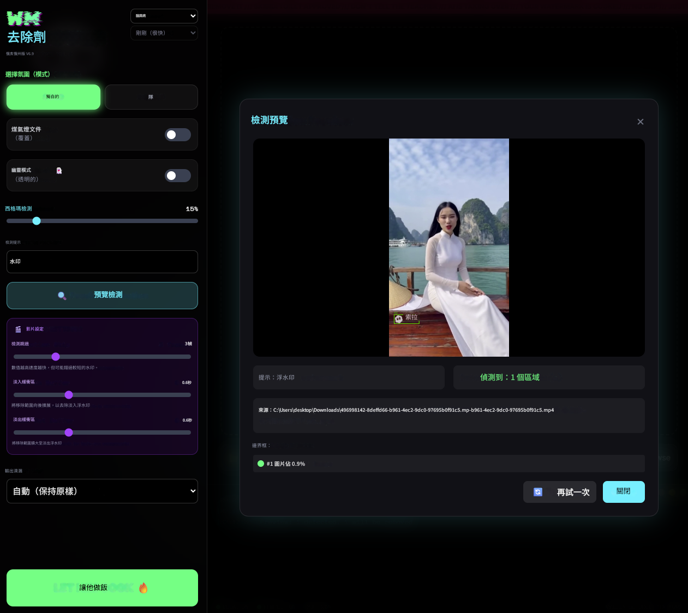

# WatermarkRemover-AI

**基於 Florence-2 與 LaMA 模型的人工智慧浮水印去除工具**
---

## 專案概述

`WatermarkRemover-AI` 是一款頂尖的應用程式，利用 AI 模型進行精確的浮水印偵測與無縫去除。非常適合用來清除 Sora、Sora 2、Runway 等 AI 生成影片中的浮水印。

本工具採用微軟（Microsoft）的 Florence-2 模型進行浮水印識別，並結合 LaMA 模型進行影像修補（Inpainting），讓移除區域能自然地與背景融合。軟體介面採用 PyWebview 打造，提供現代化且直觀的圖形使用者介面（GUI）體驗。

## 軟體截圖



## 示範影片

https://github.com/user-attachments/assets/505be2a8-8eda-4def-90b6-5a4ceefee456

---

## 功能特色

- **智慧偵測**：使用 Florence-2 進行 AI 驅動的浮水印自動偵測。
- **無縫移除**：透過 LaMA 影像修補技術獲得極其自然的修復結果。
- **影片支援**：支援影片處理，具備雙階段偵測模式並可完整保留音軌。
- **AI 影片優化**：專為移除 Sora、Sora 2、Runway 等 AI 生成影片的浮水印而設計。
- **批次處理**：可一次處理整個資料夾。
- **預覽模式**：在正式處理前先預覽偵測到的浮水印範圍。
- **淡入/淡出處理**：針對逐漸顯現或消失的浮水印，可自動延伸遮罩時間。
- **GPU 加速**：支援 CUDA，大幅提升處理速度。
- **多國語言介面**：提供英文、法文、繁體中文、日文、葡萄牙文等多種語言。
- **佈景主題**：內建多款 UI 主題供使用者選擇。

---

## 安裝指南

### Windows 系統

安裝腳本會自動下載可攜式（Portable）Python 環境，您的系統無需預先安裝 Python。

```powershell
git clone https://github.com/dryade36513/WatermarkRemover-AI.git
cd WatermarkRemover-AI
.\setup.ps1
```

安裝完成後，直接雙擊 `run.bat` 即可啟動程式。

### Linux / macOS 系統

系統需預先安裝 Python 3.10 或以上版本。

```bash
git clone https://github.com/dryade36513/WatermarkRemover-AI.git
cd WatermarkRemover-AI
chmod +x setup.sh
./setup.sh
```

安裝完成後，執行 `./run.sh` 即可啟動程式。

### 選配項目：FFmpeg

若要在處理影片時保留音訊，請安裝 FFmpeg：
- **Windows**：請至 [ffmpeg.org](https://ffmpeg.org/download.html) 下載並加入系統路徑（PATH）。
- **Linux**：執行 `sudo apt install ffmpeg`。
- **macOS**：執行 `brew install ffmpeg`。

---

## 使用說明

### 圖形介面（GUI）模式

1. 啟動程式（Windows 執行 `run.bat`；macOS/Linux 執行 `./run.sh`）。
2. 從右上角選擇您偏好的語言與主題。
3. 選擇模式（單一檔案或批次處理）。
4. 設定輸入與輸出路徑。
5. 根據需求調整設定。
6. 點擊 **「開始處理」（Start Processing）**。

您的設定將在下次啟動時自動載入。

### 命令列（CLI）模式

```bash
# 基本用法
python remwm.py input.png output_folder/

# 使用進階選項
python remwm.py ./images ./output --overwrite --max-bbox-percent=15 --force-format=PNG

# 處理影片並使用雙階段偵測
python remwm.py video.mp4 ./output --detection-skip=3 --fade-in=0.5 --fade-out=0.5

# 預覽模式（僅偵測而不處理）
python remwm.py input.png --preview
```

### CLI 參數說明

| 參數 | 說明 |
|--------|-------------|
| `--overwrite` | 覆蓋已存在的檔案 |
| `--transparent` | 將浮水印區域變為透明（僅限圖片） |
| `--max-bbox-percent` | 偵測區域佔圖片的最大比例（預設：10） |
| `--force-format` | 強制輸出格式（PNG, WEBP, JPG, MP4, AVI） |
| `--detection-prompt` | 自定義偵測提示詞（預設："watermark"） |
| `--detection-skip` | 影片處理時每隔 N 幀偵測一次（1-10，預設：1） |
| `--fade-in` | 向前延伸遮罩 N 秒（適用於淡入浮水印） |
| `--fade-out` | 向後延伸遮罩 N 秒（適用於淡出浮水印） |
| `--preview` | 僅預覽偵測到的浮水印，不執行移除處理 |

---

## 影片處理細節

- **支援格式**：MP4, AVI, MOV, MKV, FLV, WMV, WEBM。
- **音訊保留**：需安裝 FFmpeg。
- **雙階段模式**：設定 `--detection-skip` 大於 1 可加快處理速度。
- **淡化處理**：針對逐漸出現或消失的浮水印，請使用 `--fade-in` / `--fade-out` 參數。

---

## 技術棧

- **Florence-2**：微軟開發的視覺模型，用於浮水印偵測。
- **LaMA**：大型遮罩影像修補模型（Large Mask Inpainting）。
- **PyWebview**：跨平台 Webview 封裝庫。
- **Alpine.js**：輕量級 UI 互動 JavaScript 框架。
- **PyTorch**：深度學習後端引擎。

---

## 貢獻指南

歡迎任何形式的貢獻！您可以：

1. Fork 本專案。
2. 建立功能分支（Feature Branch）。
3. 提交 Pull Request。

---

## 開源授權

本專案採用 MIT 授權條款。詳情請參閱 [LICENSE](LICENSE) 檔案。

---

## 星星成長史

[](https://www.star-history.com/#dryade36513/WatermarkRemover-AI&type=date&legend=top-left)
